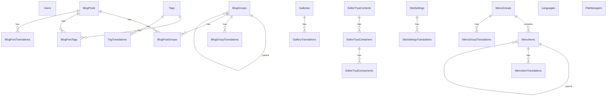

# TishtryaCMS Database Structure

SQL Server database `TishtryaCMS`, managed by EF Core 10 in a modular monolith. Schemas are created and kept up to date at API startup via module seeders (no EF migration folders). See [README.md](README.md) for connection string and run instructions.

## Schema map

| SQL schema | Module | Tables |
|---|---|---|
| `identity` | Identity | 1 |
| `content` | ContentModules | 14 |
| `filemanager` | FileManager | 1 |
| `editortrya` | EditorTrya | 3 |
| `settings` | Settings | 3 |

**Total: 22 tables**

Source of truth: `*Seeder.cs` / `*DbContext.cs` under each module’s `Infrastructure/` folder.

## Entity relationship diagram

## Notes

- **Translations:** Localized fields live in `*Translations` tables keyed by `language_prefix` (typically `en`, `fa`, `ar` from `settings.Languages`). Base entity columns keep a default/fallback copy of the primary language.
- **Slug uniqueness:** After translation tables exist, unique constraints on `BlogPosts.slug`, `BlogGroups.slug`, `Tags.slug`, and `Galleries.slug` are dropped. Uniqueness is enforced per language on `(language_prefix, slug)` in the translation tables.
- **Soft links (indexed, no FK):** `Galleries.created_by` → user id; `MenuItems.target_id` → linked entity id; `FileManagers.parent_id` and `EditorTryaContainers.parent_id` are hierarchy ids without FK.
- **Legacy:** If present, `content.Posts` is dropped at startup.

---

## Schema: `identity`

Created via EF `EnsureCreatedAsync` (PascalCase column names).

### `identity.Users`

| Column | Type | Nullable | Notes |
|---|---|---|---|
| Id | uniqueidentifier | NO | PK |
| Email | nvarchar(256) | NO | Unique index |
| PasswordHash | nvarchar(512) | NO | |
| Role | nvarchar(64) | NO | |
| DisplayName | nvarchar(128) | NO | |
| IsActive | bit | NO | |
| CreatedAtUtc | datetime2 | NO | |

---

## Schema: `content`

IDs default to `NEWSEQUENTIALID()` unless noted. FK delete behavior: **CASCADE** where stated; otherwise **Restrict** (SQL Server default).

### `content.BlogGroups`

| Column | Type | Nullable | Notes |
|---|---|---|---|
| id | uniqueidentifier | NO | PK, default NEWSEQUENTIALID |
| title | nvarchar(200) | NO | |
| slug | nvarchar(200) | NO | Unique dropped after translations migrate |
| keyword | nvarchar(500) | YES | |
| description | nvarchar(max) | YES | |
| parent_id | uniqueidentifier | YES | FK → `BlogGroups(id)` |

Indexes: `IX_BlogGroups_parent_id`

### `content.BlogPosts`

| Column | Type | Nullable | Notes |
|---|---|---|---|
| id | uniqueidentifier | NO | PK |
| title | nvarchar(255) | NO | |
| slug | nvarchar(255) | NO | Unique dropped after translations migrate |
| keyword | nvarchar(max) | YES | |
| description | nvarchar(max) | YES | |
| content | nvarchar(max) | YES | |
| meta_title | nvarchar(255) | YES | |
| meta_description | nvarchar(max) | YES | |
| status | nvarchar(20) | NO | |
| created_at | datetime2 | NO | |
| updated_at | datetime2 | NO | |

### `content.Tags`

| Column | Type | Nullable | Notes |
|---|---|---|---|
| id | uniqueidentifier | NO | PK |
| title | nvarchar(100) | NO | |
| slug | nvarchar(100) | NO | Unique dropped after translations migrate |
| description | nvarchar(max) | YES | |

### `content.BlogPostGroups` (M2M)

| Column | Type | Nullable | Notes |
|---|---|---|---|
| id | uniqueidentifier | NO | PK |
| post_id | uniqueidentifier | NO | FK → `BlogPosts` ON DELETE CASCADE |
| group_id | uniqueidentifier | NO | FK → `BlogGroups` |

Constraints: `UQ_BlogPostGroups_post_group` unique `(post_id, group_id)`  
Indexes: `IX_BlogPostGroups_post_id`, `IX_BlogPostGroups_group_id`

### `content.BlogPostTags` (M2M)

| Column | Type | Nullable | Notes |
|---|---|---|---|
| id | uniqueidentifier | NO | PK |
| post_id | uniqueidentifier | NO | FK → `BlogPosts` ON DELETE CASCADE |
| tag_id | uniqueidentifier | NO | FK → `Tags` |

Constraints: `UQ_BlogPostTags_post_tag` unique `(post_id, tag_id)`  
Indexes: `IX_BlogPostTags_post_id`, `IX_BlogPostTags_tag_id`

### `content.Galleries`

| Column | Type | Nullable | Notes |
|---|---|---|---|
| id | uniqueidentifier | NO | PK |
| title | nvarchar(200) | NO | |
| slug | nvarchar(200) | NO | Unique dropped after translations migrate |
| keyword | nvarchar(500) | YES | |
| description | nvarchar(max) | YES | |
| created_by | uniqueidentifier | YES | Soft link to user; no FK |
| created_at | datetime2 | NO | |
| updated_at | datetime2 | NO | |

Indexes: `IX_Galleries_created_by`

### `content.MenuGroups`

| Column | Type | Nullable | Notes |
|---|---|---|---|
| id | uniqueidentifier | NO | PK |
| title | nvarchar(200) | NO | |
| key | nvarchar(100) | NO | Unique `UQ_MenuGroups_key` |
| description | nvarchar(max) | YES | |
| sort_order | int | NO | |
| is_active | bit | NO | |

### `content.MenuItems`

| Column | Type | Nullable | Notes |
|---|---|---|---|
| id | uniqueidentifier | NO | PK |
| title | nvarchar(200) | NO | |
| url | nvarchar(500) | NO | |
| parent_id | uniqueidentifier | YES | FK → `MenuItems(id)` |
| group_id | uniqueidentifier | NO | FK → `MenuGroups(id)` |
| data | nvarchar(max) | YES | |
| function | nvarchar(50) | NO | |
| target_id | uniqueidentifier | YES | Soft link; no FK |
| is_mega_menu | bit | NO | Default `0` |
| sort_order | int | NO | |
| is_active | bit | NO | |

Indexes: `IX_MenuItems_group_id`, `IX_MenuItems_parent_id`, `IX_MenuItems_target_id`

### `content.BlogPostTranslations`

| Column | Type | Nullable | Notes |
|---|---|---|---|
| id | uniqueidentifier | NO | PK |
| post_id | uniqueidentifier | NO | FK → `BlogPosts` ON DELETE CASCADE |
| language_prefix | nvarchar(20) | NO | |
| title | nvarchar(255) | NO | |
| slug | nvarchar(255) | NO | |
| keyword | nvarchar(max) | YES | |
| description | nvarchar(max) | YES | |
| content | nvarchar(max) | YES | |
| meta_title | nvarchar(255) | YES | |
| meta_description | nvarchar(max) | YES | |

Uniques: `(post_id, language_prefix)`, `(language_prefix, slug)`

### `content.BlogGroupTranslations`

| Column | Type | Nullable | Notes |
|---|---|---|---|
| id | uniqueidentifier | NO | PK |
| group_id | uniqueidentifier | NO | FK → `BlogGroups` ON DELETE CASCADE |
| language_prefix | nvarchar(20) | NO | |
| title | nvarchar(200) | NO | |
| slug | nvarchar(200) | NO | |
| keyword | nvarchar(500) | YES | |
| description | nvarchar(max) | YES | |

Uniques: `(group_id, language_prefix)`, `(language_prefix, slug)`

### `content.TagTranslations`

| Column | Type | Nullable | Notes |
|---|---|---|---|
| id | uniqueidentifier | NO | PK |
| tag_id | uniqueidentifier | NO | FK → `Tags` ON DELETE CASCADE |
| language_prefix | nvarchar(20) | NO | |
| title | nvarchar(100) | NO | |
| slug | nvarchar(100) | NO | |
| description | nvarchar(max) | YES | |

Uniques: `(tag_id, language_prefix)`, `(language_prefix, slug)`

### `content.GalleryTranslations`

| Column | Type | Nullable | Notes |
|---|---|---|---|
| id | uniqueidentifier | NO | PK |
| gallery_id | uniqueidentifier | NO | FK → `Galleries` ON DELETE CASCADE |
| language_prefix | nvarchar(20) | NO | |
| title | nvarchar(200) | NO | |
| slug | nvarchar(200) | NO | |
| keyword | nvarchar(500) | YES | |
| description | nvarchar(max) | YES | |

Uniques: `(gallery_id, language_prefix)`, `(language_prefix, slug)`

### `content.MenuGroupTranslations`

| Column | Type | Nullable | Notes |
|---|---|---|---|
| id | uniqueidentifier | NO | PK |
| group_id | uniqueidentifier | NO | FK → `MenuGroups` ON DELETE CASCADE |
| language_prefix | nvarchar(20) | NO | |
| title | nvarchar(200) | NO | |
| description | nvarchar(max) | YES | |

Unique: `(group_id, language_prefix)`

### `content.MenuItemTranslations`

| Column | Type | Nullable | Notes |
|---|---|---|---|
| id | uniqueidentifier | NO | PK |
| item_id | uniqueidentifier | NO | FK → `MenuItems` ON DELETE CASCADE |
| language_prefix | nvarchar(20) | NO | |
| title | nvarchar(200) | NO | |
| url | nvarchar(500) | NO | |
| data | nvarchar(max) | YES | |

Unique: `(item_id, language_prefix)`

---

## Schema: `filemanager`

### `filemanager.FileManagers`

| Column | Type | Nullable | Notes |
|---|---|---|---|
| id | uniqueidentifier | NO | PK, default NEWSEQUENTIALID |
| component | nvarchar(100) | NO | Owner module/component key |
| parent_id | uniqueidentifier | YES | Soft hierarchy; no FK |
| ordered | int | NO | Default `1` |
| publish | bit | NO | Default `1` |
| folder | nvarchar(500) | YES | |
| filename | nvarchar(255) | NO | |
| extension | nvarchar(20) | NO | |
| full_address | nvarchar(1000) | NO | |
| namefile | nvarchar(255) | YES | |
| created_at | datetime | NO | Default `GETDATE()` |
| updated_at | datetime | YES | |

Indexes:

- `IX_FileManagers_component_parent_id` `(component, parent_id)`
- `IX_FileManagers_component_parent_id_ordered` `(component, parent_id, ordered)`
- `IX_FileManagers_filename`
- `IX_FileManagers_publish`

---

## Schema: `editortrya`

### `editortrya.EditorTryaContents`

| Column | Type | Nullable | Notes |
|---|---|---|---|
| id | uniqueidentifier | NO | PK |
| component | nvarchar(100) | NO | |
| parent_id | uniqueidentifier | NO | Owner entity id (soft link) |
| language_prefix | nvarchar(20) | NO | |
| publish | bit | NO | Default `1` |
| created_at | datetime2 | NO | |
| updated_at | datetime2 | YES | |

Unique: `UQ_EditorTryaContents_component_parent_lang` `(component, parent_id, language_prefix)`

### `editortrya.EditorTryaContainers`

| Column | Type | Nullable | Notes |
|---|---|---|---|
| id | uniqueidentifier | NO | PK |
| content_id | uniqueidentifier | NO | FK → `EditorTryaContents` ON DELETE CASCADE |
| parent_id | uniqueidentifier | YES | Nested container; no FK |
| component | nvarchar(100) | YES | |
| cols | int | YES | |
| ordered | int | NO | Default `1` |
| publish | bit | NO | Default `1` |
| options | nvarchar(max) | YES | |
| created_at | datetime2 | NO | |
| updated_at | datetime2 | YES | |

Indexes: `content_id`, `(content_id, ordered)`, `parent_id`

### `editortrya.EditorTryaComponents`

| Column | Type | Nullable | Notes |
|---|---|---|---|
| id | uniqueidentifier | NO | PK |
| container_id | uniqueidentifier | NO | FK → `EditorTryaContainers` ON DELETE CASCADE |
| type | nvarchar(100) | NO | |
| ordered | int | NO | Default `1` |
| publish | bit | NO | Default `1` |
| data | nvarchar(max) | YES | |
| options | nvarchar(max) | YES | |
| created_at | datetime2 | NO | |
| updated_at | datetime2 | YES | |

Indexes: `container_id`, `(container_id, ordered)`, `type`, `publish`

---

## Schema: `settings`

### `settings.SiteSettings`

| Column | Type | Nullable | Notes |
|---|---|---|---|
| id | uniqueidentifier | NO | PK (no DB default; set by app) |
| name | nvarchar(200) | NO | |
| title | nvarchar(255) | NO | |
| keyword | nvarchar(500) | YES | |
| description | nvarchar(max) | YES | |
| logo_url | nvarchar(1000) | YES | |
| social_links_json | nvarchar(max) | NO | |
| contact_addresses_json | nvarchar(max) | NO | |
| contact_phones_json | nvarchar(max) | NO | |
| contact_emails_json | nvarchar(max) | NO | |
| storage_provider | nvarchar(20) | NO | |
| s3_endpoint | nvarchar(500) | YES | |
| s3_bucket | nvarchar(200) | YES | |
| s3_access_key | nvarchar(500) | YES | |
| s3_secret_key | nvarchar(500) | YES | |
| s3_region | nvarchar(100) | YES | |
| s3_public_base_url | nvarchar(500) | YES | |
| updated_at_utc | datetime2 | NO | |

### `settings.Languages`

| Column | Type | Nullable | Notes |
|---|---|---|---|
| id | uniqueidentifier | NO | PK, default NEWSEQUENTIALID |
| name | nvarchar(100) | NO | |
| prefix | nvarchar(20) | NO | Unique `UQ_Languages_prefix` |
| is_default | bit | NO | Default `0` |
| direction | nvarchar(10) | NO | Default `ltr` |

### `settings.SiteSettingsTranslations`

| Column | Type | Nullable | Notes |
|---|---|---|---|
| id | uniqueidentifier | NO | PK |
| site_settings_id | uniqueidentifier | NO | FK → `SiteSettings` ON DELETE CASCADE |
| language_prefix | nvarchar(20) | NO | |
| name | nvarchar(200) | NO | |
| title | nvarchar(255) | NO | |
| keyword | nvarchar(500) | YES | |
| description | nvarchar(max) | YES | |
| contact_addresses_json | nvarchar(max) | NO | |

Unique: `(site_settings_id, language_prefix)`
